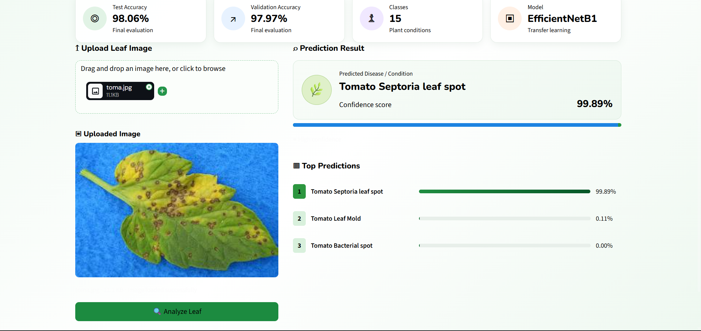
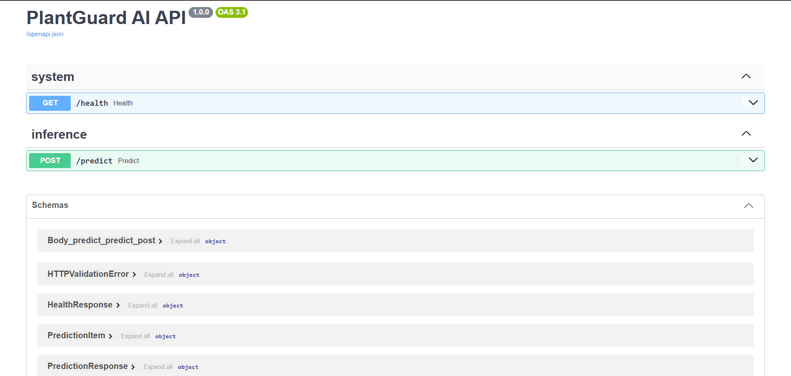

# 🌿 PlantGuard AI

**AI-powered plant disease classification system built with EfficientNetB1, FastAPI, Streamlit, and Docker.**

PlantGuard AI analyzes plant leaf images and predicts the most likely disease or healthy condition. The system provides a confidence score and ranked predictions through a Streamlit web interface backed by a FastAPI inference API.



---

## 📊 Model Performance

The trained EfficientNetB1 model was evaluated on the project's validation and test data.

| Metric | Result |
|---|---:|
| **Test Accuracy** | **98.06%** |
| **Validation Accuracy** | **97.97%** |
| **Macro F1 Score** | **97.95%** |
| **Model** | EfficientNetB1 |
| **Input Size** | 240 × 240 |
| **Color Mode** | RGB |
| **Number of Classes** | 15 |
| **Images After Deduplication** | 20,624 |
| **Duplicate Images Removed** | 14 |

> **Note:** 98.06% is the measured test-set accuracy. Individual prediction confidence can be different from overall model accuracy.

---

## 🚀 Features

- 🌱 Plant disease classification from leaf images
- 🧠 EfficientNetB1 transfer-learning model
- 📈 98.06% test accuracy
- 🎯 Top-3 ranked predictions
- 📊 Prediction confidence scores
- 🖼️ Image preview before analysis
- ⚡ FastAPI inference backend
- 🎨 Streamlit web interface
- 🐳 Docker and Docker Compose support
- ❤️ Backend health monitoring
- 🔒 Image upload validation
- 📐 Configurable image preprocessing
- 🧪 Automated unit tests
- 📚 Interactive Swagger API documentation

---

## 🌱 Supported Plant Conditions

The current model supports **15 classes**.

### Pepper

- Pepper Bell — Bacterial Spot
- Pepper Bell — Healthy

### Potato

- Potato — Early Blight
- Potato — Late Blight
- Potato — Healthy

### Tomato

- Tomato — Bacterial Spot
- Tomato — Early Blight
- Tomato — Late Blight
- Tomato — Leaf Mold
- Tomato — Septoria Leaf Spot
- Tomato — Spider Mites
- Tomato — Target Spot
- Tomato — Tomato Yellow Leaf Curl Virus
- Tomato — Tomato Mosaic Virus
- Tomato — Healthy

---

## 🖥️ Application

The Streamlit interface provides an image upload workflow and displays the predicted condition, confidence score, and top-ranked alternative predictions.

### Prediction Example


Example prediction:

**Tomato Septoria leaf spot — 99.89% confidence**

The application also displays the top three predictions with their confidence scores.

> The 99.89% value above represents the confidence of this individual prediction, not the overall test accuracy of the model.

---

## 🔌 API

PlantGuard AI uses **FastAPI** as the inference backend.

### Available Endpoints

| Method | Endpoint | Purpose |
|---|---|---|
| `GET` | `/health` | Check API and model status |
| `POST` | `/predict` | Run plant disease prediction |
| `GET` | `/docs` | Interactive Swagger API documentation |

### API Documentation



The `/predict` endpoint accepts an uploaded plant leaf image and returns the prediction results.

---

## 🏗️ Architecture

```text
                    ┌─────────────────────┐
                    │   User / Browser    │
                    └──────────┬──────────┘
                               │
                               ▼
                    ┌─────────────────────┐
                    │  Streamlit Frontend │
                    │      Port 8501      │
                    └──────────┬──────────┘
                               │
                         HTTP Request
                               │
                               ▼
                    ┌─────────────────────┐
                    │    FastAPI API      │
                    │      Port 8000      │
                    └──────────┬──────────┘
                               │
                               ▼
                    ┌─────────────────────┐
                    │ Image Validation &  │
                    │    Preprocessing    │
                    └──────────┬──────────┘
                               │
                               ▼
                    ┌─────────────────────┐
                    │   EfficientNetB1    │
                    │    Keras Model      │
                    └──────────┬──────────┘
                               │
                               ▼
                    ┌─────────────────────┐
                    │ Prediction + Top-3  │
                    │    Confidence       │
                    └─────────────────────┘


                    🛠️ Technology Stack
Machine Learning
Python
TensorFlow / Keras
EfficientNetB1
Transfer Learning
Image Classification
Backend
FastAPI
Uvicorn
Pydantic
Frontend
Streamlit
Deployment
Docker
Docker Compose
Testing
Pytest
Ruff


Plant-Disease/
│
├── backend/
│   ├── app/
│   │   ├── config.py
│   │   ├── image_utils.py
│   │   ├── inference.py
│   │   ├── main.py
│   │   ├── preprocessing.py
│   │   └── schemas.py
│   └── Dockerfile
│
├── frontend/
│   ├── streamlit_app.py
│   └── Dockerfile
│
├── model/
│   ├── class_mapping.json
│   ├── class_mapping.example.json
│   ├── model_info.json
│   └── plant_disease_model.keras
│
├── tests/
│   ├── test_api.py
│   ├── test_class_mapping.py
│   ├── test_image_validation.py
│   ├── test_model_loading.py
│   └── test_preprocessing.py
│
├── .dockerignore
├── .env.example
├── .gitignore
├── docker-compose.yml
├── pyproject.toml
├── requirements.txt
├── requirements-api.txt
├── requirements-ui.txt
└── README.md


---

# 🐳 Run with Docker

Docker Compose is the recommended way to run the complete application.

### 1. Clone the repository

```bash
git clone https://github.com/Swagatpawar/Plant-Disease.git
cd Plant-Disease